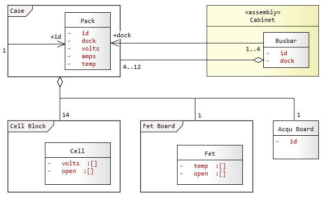
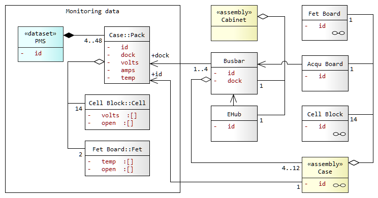

# monitoring.pms Dataset
---

A PMS system consists of 1-4 Cabinets with 1 Busbar in each Cabinet.

Each Busbar docks 4-12 **Cases**.

- Case and Pack data are related through a shared **id**.
- Pack data includes the Busbar **dock** number.

A Case contains 14 **Cell Blocks**, 1 **Fet Board**, and 1 **Acqu. Board**. 

PMS data consists of two distinct datasets, _Monitoring_ data and _Transaction/Master_ data, which are joined through a relationship as shown in the model below:


### Monitoring Data

PMS monitoring data streams in as a time-series unbounded dataset. The data is schedule-driven (e.g. every 5 seconds) and is append-only.

Monitoring data is collected from:
- 4-48 **Packs**
- 14 **Cells** per Pack
- 2 **Fets** per Pack

The dataset is collected through a recurring schedule and appended to a time-series log. 

The Monitoring Dataset links to Master data through a shared key in **Pack id** and **Case Id** respectively. 



### Transaction/Master Data 

Unlike PMS monitoring data, master data is event-driven, has inserts and updates, and is infrequently changed.

The PMS master and transaction data includes Cases and Cabinets (Ehub or BBC) assemblies, including a record of changes when components are procured, installed, or swapped.

A **Case** contains:
- 14 **Cell Blocks**
- 1 **Acqu. Board**
- 1 **Fet Board** containing 2 **Fets**

A **Cabinet** contains:
- 1 **EHub**
- 1 **Busbar** with 4-12 **Cases**

A Case links to Pack data through a shared ID. The human readable ID is stored on each Case's **Acqu. Board**.

A PMS can have 1-4 Cabinets. If there are multiple Cabinets the same **PMS id** will be shared and stored on each Cabinet's **EHub**.


### Identifiers

The PMS dataset depends on two identifiers, the rest of this dataset consists entirely of data needed for monitoring and analytics.

**Pack id**

- The **Pack id** _is_ the **Case id** (laser engraved in human-readable form on outside of case).

- Initially (temporarily) the **Pack id** will be populated with the **Acqu Board id** and converted through a lookup to the **Case id** on the server.

- In future the **Case Id** will be directly stored on the **Acqu Board** during pre-shipment configuration. No further data transformation will be required for determining the Pack id during data collection.

**PMS id**

- The **PMS id** is configured for each site during pre-shipment configuration.

- It is stored on each **Ehub** (or BBC); upto 4 EHubs (i.e. Cabinets) can have the same PMS id.

- It allows Packs to be hot-swapped on site without any re-configuration needed.

---

# Request Message

The following snippet shows the structure of a `pms` request:

```json
{
  "datasets": [
    { "pms": { "id": "PMS-01-001" }, 
      "data": [
        { "time_local": "20190209T150006.032+0700",
          "pack": { "id": "0241", "dock": 1, "amps": -1.601, "temp": [35.0, 33.0, 34.0],
            "cell": { "open": [1, 6],
              "volts": [3.92, 3.92, 3.92, 3.92, 3.92, 3.92, 3.92, 3.92, 3.92, 3.92, 3.92, 3.92, 3.92, 3.91] },
            "fet": { "open": [1, 2], "temp": [34.1, 32.2, 33.5] } }
        },
```

### Message Attributes 

The pms request message attributes are specified below. 

Attribute | Metric | Data | Constraint | Description
--- | --- | --- | --- | --- 
`pms.id` | - | string | - | The `pms.id` is configured for each site during pre-shipment. It is stored on each Ehub (or BBC); upto 4 EHubs (i.e. Cabinets) can share the same `pms.id`. The id is the foreign key for relationally joining the pms dataset to reference data in the cloud. As packs self identify they cab be hot-swapped on site without any need for re-configuring pack metadata.
`time_local` | - | datetime | RFC 3339 | The local time of the event which produced this data sample, represented with a mandatory `+/-` offset from UTC for the device's location, in compressed `ISO 8601/RFC3339` (YYYYMMDDThhmmss±hhmm).
`pack.id` | - | string | - | The pack identifier. This is the Case id which is laser engraved in human-readable form on the outside of the case. Initially (temporarily) the `pack.id` will be populated with the pack’s acquisition board hardware id, and converted to the Case id through a lookup on the server. In future the Case id will be directly stored in the acquisition board during pre-shipment configuration and no further data transformation will be required for determining the Pack id during data collection.
`pack.dock` | - | integer | 1-48 | The dock number (1 - 48) into which this pack is installed. The dock number covers 4 cabinets with 12 docks per cabinet in sequence. For example dock number 13 indicates that the pack is installed in dock 1 of cabinet B (the second cabinet).
`pack.amps` | amps | float [+/-] | - | The current draw for this pack. The value is positive for charge current and negative when discharging. 
`pack.temp` | degC | float *(array)* | *array size 3* | An ordered set of 3 temperature readings in degC, for the temperature of the cell-pack at its top, middle, and bottom. The array position of  each value is significant: the 1st value applies to the top of the pack, 2nd to the middle, and 3rd to the bottom. 
`cell.volts` | volts | float *(array)* | *array size 14* | An ordered set of 14 Voltage readings for 14 cellblocks in this pack. Each value in the data array applies to a cell number based on its position in the array. For example the 2nd value in the data array is the data for the 2nd cell in the pack. The pack voltage is not included in the monitoring dataset: as cellblocks are connected in series the pack voltage is calculated later as the sum of all 14 cell voltages.
`cell.open` | *open/closed* | integer *(array)* | 1-14, *uniqueitems, array size 0-14* | An unordered set of unique ordinal numbers for cells  which are ‘open’ due to cell balancing. Must contain numbers from 1-14 as there are only 14 cells in a pack. For example a data value of [1,6] signifies that cell 1 and 6 are open (bypassed) to allow the other cells in the pack to charge and reach parity with this cell block. Typically the array will be empty to indicate that there is no cell balancing in effect.
`fet.temp` | degC | float | *array size 2* | An ordered set of temperature readings for the two MOSFETS in this pack. The first is the input (CMOS) and the 2nd is the output (DMOS) MOSFET.
`fet.open` | *open/closed* | integer *(array)* | 1-2, *uniqueitems, array size 2* | An unordered set of unique ordinal numbers for FETs which are ‘open’ due to pack balancing. The data values must be a number from 1-2 as there are only 2 FETS in each pack. For example a data value of [1,2] signifies that FETS 1 and 2 are both open.
 
- Attributes marked as '*required on change*' may be omitted if the value has not changed since the last successful post (a POST is successful if the API server responds with a 200 level reply).
All other attributes are mandatory and must be present.

---

# Dataset Structure 

The following attributes are added to request message attributes at the first stage of processing the `/devices` POST request. 

The added timestamps are based on `time_local` sent in the request message, which is replaced by these timestamps.  

The dataset timestamps are stored in the canonical timestamp format used for data storage ('YYYY-MM-DD HH:mm:ss.SSSS') as shown in the examples.

Attribute | Metric | Data | Constraint | Description
--- | --- | --- | --- | ---
`id` | - | string | - | Id of the Inverter charge controller. This attribute replaces `pms.id` in the request message.
`time_utc` | - | datetime | - | The UTC time of the event which produced this data sample.
`time_local` | - | datetime | - | The local time of the event which produced this data sample. Note that the timezone offset is discarded.
`time_processing` | - | datetime | - | The UTC time when the request was received and *processed* on the API host.
`pack.volts` | - | float | - | The cellblocks are connected in series so the pack voltage is the sum of all 14 cell voltages (`cell.volts[1-14]`).
`pack.watts` | - | float | - | The product of `pack.volts` and `pack.amps`.
`cell.vcl` | volts | float | - | The lowest cell voltage in `cell.volts`.
`cell.vch` | volts | float | - | The highest cell voltage in `cell.volts`.
`cell.dvcl` | millivolts | float *(array)* | *array size 14* | The millivolt difference (delta), between the lowest cell voltage (`cell.vcl`) and the each cell (`cell.volts`). Each value in the data array applies to a cell number based on its position in the array.

The dataset structure sent to the message broker at the first stage of processing is shown in the followng sample:

```
*** MESSAGE ***
Topic: pms
Key: PMS-01-001
Value:	
```

```json
{
    "id": "PMS-01-002",
    "time_utc": "2019-02-09 08:00:17.0200",
    "time_local": "2019-02-09 15:00:17.0200",
    "time_processing": "2019-09-02 08:22:13.4310",
    "pack": { 
        "id": "0248", "dock": 4, "volts": 51.262, "amps": -0.625, "watts": -32.039,
        "temp": [35,33,34], 
        "cell": { 
            "open": [1,6], 
            "volts": [3.661,3.666,3.655,3.676,3.658,3.662,3.660,3.659,3.658,3.657,3.656,3.665,3.669,3.661],
            "vcl": 3.654, "vch": 3.676, "dvcl": [7,12,0,22,4,8,6,5,4,3,2,11,15,7] },
        "fet": { 
            "open": [1,2], 
            "temp": [34.1,32.2,33.5] }    
    }
},

```

