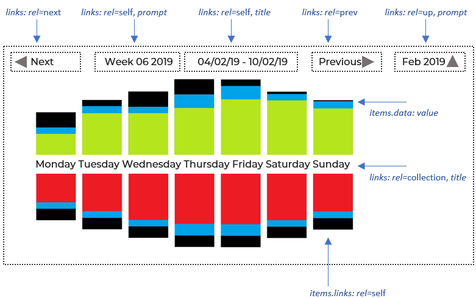

# /energy GET
---

The `/energy` path returns a ‘cube’ of energy data for a specified number of periods starting at an epoch. 

It response contains aggregated data for the requested period, and for its child period. For example a request for a *week* period will produce a response with data aggregated for the *week* and for its child period: *day*.

The response will also include links to navigate from the reqested period to adjacent periods (next week, month etc.). 

- /energy/{`energy`}/period/{`period`}/{`epoch`}/{`duration`}?site={`site`}

    e.g. [http://api.endpoints.sundaya.cloud.goog/energy/hse/period/week/20150204/1?site=999](http://api.endpoints.sundaya.cloud.goog/energy/hse/period/week/20150204/1?site=999 "energy=hse, period=week, duration=1, site=999")

### Path parameters

The following path parameters are required in energy data requests. If a parameter is omitted it will be defaulted as shown. If the paramter was provided it will be validated agains the controlled value lists (enums) specified in the API.     

Parameter | Description | Default
--- | --- | --- 
`energy` | The type of energy flow. | *hse*
`period` | The time window for which total energy is aggregated. The only exception is 'instant' (which is for a single point in time, a millisecond) which is presented without aggregation. | *week*
`epoch` | The starting date and time for the period. | current UTC date-time
`duration` | The number of periods to return starting at epoch. | *1*
`site` | The customer site where energy assets have been installed. | *999*

### period, epoch, duration
- The returned data includes the child and grandchild of the requested `period`. For example if a request is made for a */week* the response will contain total energy for each *day* and a breakdown of energy for each *hour*. 

- The `duration` parameter specifies the third dimension. It returns multiples of the above period data arrays. For example if a request is made for a */week* period with a duration of 3, the response will contain 3 collections of weekly energy data as described above, starting at the requested epoch. 

- `epoch` specifies  the starting date-time of the period. The epoch is displayed in links in the the `href` attribute, after the `period`. 

The following table describes each `period` and formats used for `epoch` in the returned data. 

- The *compressed* format is used in hyperlinks (in the `href` attribute) and the *uncompressed* format is intended for use in display labels.

- An `instant` represents a single point in time (a millisecond). As such there is no data aggregation for `instant`.

- `second` and `minute` periods both include aggregates of any instants in which data was logged.

- `timeofday` refers to 6-hourly blocks of time for Morning, Afternoon, Evening, Night.

Period | Child Period | Duration | Grandchild Period | Duration | Format (*compressed*) | (*uncompressed*)
--- | --- |--- | --- | --- | --- | --- 
`instant` | - | - | - | - | YYYYMMDDTHHmmss.SSS | DD/MM/YY HHmmss.SSS
`second` | `instant` | *varies* | - | - | YYYYMMDDTHHmmss | DD/MM/YY HHmm:ss
`minute` | `second` | 60 | `instant` | *varies* | YYYYMMDDTHHmm | DD/MM/YY HH:mm
`hour` | `minute` | 60 | `second` | 60 (360) | YYYYMMDDTHHmm | DD/MM/YY HH:mm
`timeofday` | `hour` | 6 | `minute` | 60 (360) | YYYYMMDDTHHmm | DD/MM/YY HH:mm
`day` | `hour` | 4 | `minute` | 60 (240) | YYYYMMDD | DD/MM/YY
`week` | `day` | 7 | `timeofday` | 4 (28) | YYYYMMDD | DD/MM/YY
`month` | `day` | *varies* | `hour` | *varies* | YYYYMMDD | DD/MM/YY
`quarter` | `month` | 3 | `day` | *varies* | YYYYMMDD | DD/MM/YY
`year` | `quarter` | 4 | `month` | *varies* | YYYYMMDD | DD/MM/YY
`fiveyear` | `year` | 5 | `quarter` | 4 (20) | YYYYMMDD | DD/MM/YY

### Query parameters
In all requests the caller must also provide the following query parameters:

Parameter | Description | Default
--- | --- | --- 
`site` | Identifier of the customer site where energy assets have been installed. | *999*

### Body parameter
The `productCatalogItems` optional body parameter specifies a query filter for `/energy` data to be restricted to one or more products. 

The query response will contain data for *any* of the product categories, subcategories, and product types specified in the parameter. 

- If the `productCatalogItems` parameter is missing data will be returned for all products.

- If multiple products are specified data will be returned for *any* of those products.

- If a `productCategory` is specified without a subcategory or product type data will be returned for *all* subcategories and types in that category.

- The same applies if a category and `productSubcategory` is specified without a `productType`.

# /energy GET Response
---

## Link attributes

Response data is returned in a JSON Collection and includes links for the user to navigate to adjacent datasets, for example to the next or previous *week*, or to the previous *month*.

Links have the following attributes:

- **rel**  - The rel property contains the link-to-collection relationship descriptor, which can be one of the following: `self`, `collection`, `up`, `next`, `prev`. These are described below in **Link-relation types** 

- **prompt** - A brief description of the link.

- **title** - The title to display alongside the data for this item, and can be used as a caption or tooltip in the presentation..

- **href** - The URI or URL of the resource.

- **description** - The period or energy descriptor for display by user agents (applications). 

    For "self" links the `description` consists of a list of the resource parameters:
    
    `energy`, `period`, `epoch`, `duration`, `site` 

    e.g:

    -   "rel": "self", "name": "week", "description": "`hse week 20190204 1 999`"

    -   "rel": "collection", "name": "week.day" "description": "`Mon Tue Wed Thu Fri Sat Sun`"

    -   "rel": "collection", "name": "day.timeofday" "description": "`Morning Afternoon Evening Night`"

- **render** - 'image' or 'text' if the link should be retrieved and embedded; or 'link' to display as-is. If the property is missing the href link does not need to be presented.

The following table shows a set of links provided with energy data for a *week* period. 

## Link-relation types

The `rel` attribute of links in `application/vnd.collection+json` responses contain the one of the following registered link-relation types. 

The link-relation typese are based on [RFC8288](https://tools.ietf.org/html/rfc8288#page-6).

- **self**	- Identifies the link's context.

    In `collection.links` it points to the collection as a whole (`name`=*'week'*)            

    e.g. href=[http:/api.endpoints.sundaya.cloud.goog/energy/hse/period/week/20190210](http:/api.endpoints.sundaya.cloud.goog/energy/hse/period/week/20190210)

    In `collection.items.links` it points to a child item in the collection (`name`=*'day'*).

    e.g. href=[http:/api.endpoints.sundaya.cloud.goog/energy/hse/period/day/20190204](http:/api.endpoints.sundaya.cloud.goog/energy/hse/period/day/20190204)

- **collection** - in `collection.links` it points to the child items which make up the collection (`name`=*'week.day'*).
    
    e.g. href=[http:/api.endpoints.sundaya.cloud.goog/energy/hse/period/day/20190204](http:/api.endpoints.sundaya.cloud.goog/energy/hse/period/day/20190204)

- **item** - in `collection.items.links` it points to the subitems of the child item: i.e the grandchild items of the collection (`name`=*'day.hour'*).

    e.g. href=[http:/api.endpoints.sundaya.cloud.goog/energy/hse/period/hour/20190205T0600](http:/api.endpoints.sundaya.cloud.goog/energy/hse/period/hour/20190205T0600)

- **up** - Identifies the parent of the collection or item (`name`=*'month'* if a link is in collection object for a *'week'*).
    
- **next**, **prev** - Identifies the next or previous sibling of the item series (`name` = *'week'*). The `prompt` and `title` properties signify the next or previous item in the series (`prompt` = *'Week 07 2019'*).

## text/html Graph format

If the client specifies *text/html* in the request `Accept` header a formatted graph is returned as shown below.

The graph includes display labels and hyperlinks to related dataset elements as shown.

---