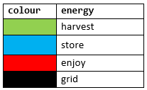
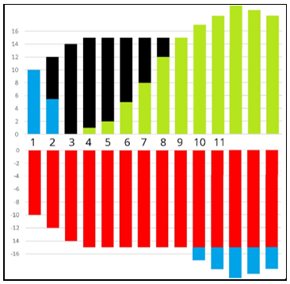
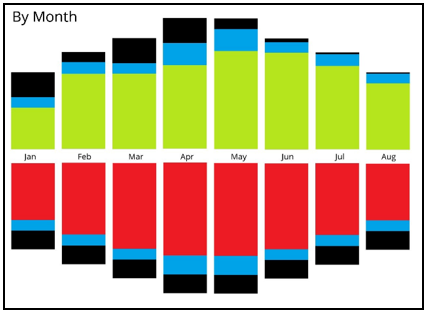

# Energy Management
---

The Energy Management API provides data for energy accounting and allows users and vendors to monitor and control their Energy Assets and Energy Management Devices. 

Energy | Assets | Devices
--- | --- | ---
`harvest` | Renewables | PV Modules, Maximum Power Point Trackers (MPPT)
`store` | Storage | Busbar Controlers (BBC), Pack Management Systems (PMS)
`enjoy` | Appliances | Multicore-Cable Current Sensors, Switchboard Clamp Sensors
`grid` | Mains Electricity | Smart Meters, PV Grid-interactive Inverters

The API is based on REST / Hypermedia and specified in [OpenAPI v2.0](https://github.com/OAI/OpenAPI-Specification/blob/master/versions/2.0.md). 

The API and documentation is available through the *Sundaya Developer Portal* at [https://developer.sundaya.com](https://developer.sundaya.com). 

### Energy API
The `/energy` path provides metrics for four **Energy Types** :`harvest`, `store`, `enjoy`, `grid`. 

The API response consolidates data for all four energy types, for a requested period (week, month etc.).

Clients can use the API to manage **Energy Assets** through graphical views and by scheduling energy use at preferred times.

### Devices API

The `/devices` path is for vendor integrations to log energy flows, and for vendors to monitor and control their **Energy Management Devices**.

# Data Structure

### Element names

The following labels are used in API paths and responses to refer to energy data subsets. 

- `store.in` and `store.out` indicate *charge* and *discharge* flows for batteries.

- `grid.out` and `grid.in` indicate mains use, and feed-in flows into the public grid.

- `harvest` refers to renewable energy generation. 

- `enjoy` indicates energy use by end users and appliances. 

### Double-entry format 

Energy flows are based on a "double entry" format (each flow has an opposite flow). 

These equal and opposite flows are summarised in the following table: 

Flow | From / To   
--- |---
`harvest` |`store.in` `enjoy` `grid.in`
`store.out` | `enjoy`
`enjoy`  |  `harvest` `store.out` `grid.out`
    
To query specific assets, clients can filter requests by `category`, `subcategory`, and `product-type` (in the request *Body*).

# Data Visualisation

### Colour codes

The API’s response data can be visualised through an application as a stacked bar graph, based on these standard colours for each dataset in the response 'data' element.

 
### Double-entry format

Graphs are typically shown in a ‘double entry’ format (the up and down bars are the same size), as shown in the following sample. 

The example shows the following behaviour:
- In the 1st hour all `enjoy` energy came from the battery (`store.out`). 
- In the 2nd hour half came from battery and the other half from grid (`grid.out`). 
- In the 3rd hour all came from the grid.
- In the 4th hour the sun starts delivering (`harvest`)
- In the 10th hour harvest data is more than enjoy and the energy flows into store (`store.in`)

A graph with lot of _Black_ in the top tier indicates that you need to do something about it. In general it indicates a need for more battery capacity and/or `harvest` generation capacity. 

### Element names

The following monthly `period` graph cotnains a representation for all data elements returned by the API.

**Top tier**

- _Green_ is always shown in the top tier as it represents renewable energy generation (`harvest`).
- _Black_ in the top tier shows energy usage from the grid (`grid.out`).
- _Blue_ in the top tier shows energy *discharge* from batteries (`store.out`).

**Bottom tier**

- _Red_ is always shown in the bottom tier as it represents energy consumption (`enjoy`).
- _Black_ in the bottom tier shows a net excess (`harvest`, `store.in`, `enjoy`) resulting in feed-in to the grid (`grid.in`). 
- _Blue_ in the bottom tier shows excess `harvest` and available battery capacity for *charge* (`store.in`).

---