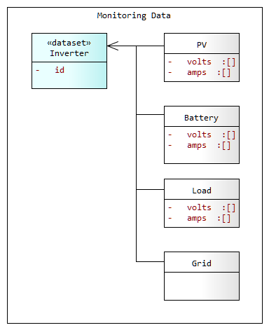

# inverter Dataset
---



# Dataset Structure 

The following snippet shows the structure of an `inverter` dataset:

```json
{
  "datasets": [
    { "inverter": { "id": "SPI-B2-01-001" }, 
      "data": [
        { "time_local": "20190209T150006.032+0700",
          "pv": { "volts": ["48.000", "48.000"], "amps": ["6.0", "6.0"] },
          "batt": { "volts" : "55.1", "amps": "-1.601" }, 
          "load": { "volts": ["48.000", "48.000"], "amps": ["1.2", "1.2"] }
        },
```

### Attributes 

The inverter dataset attributes are specified below. 

Attribute | Metric | Data | Optionality | Description
--- | --- | --- | --- | ---
`inverter.id` | - | string | - | Id of the Inverter charge controller. *(__Note__: a site can have any number of Inverter controllers, and each controller can have multiple PV strings and Loads)*.
`time_local` | - | datetime | RFC 3339 | The local time of the event which produced this data sample, represented with a mandatory `+/-` offset from UTC for the device's location, in compressed `ISO 8601/RFC3339` (YYYYMMDDThhmmss±hhmm).
`pv.volts` | volts | float *(array)* | *array size 1-4* | An ordered set of Voltage readings for PV strings connected to this Inverter. Each value in the data array applies to a numbered PV string based on its position in the array. For example the 2nd value in the data array is the data for the 2nd PV string. The array size depends on the number of PV strings. Presently upto 4 PV strings per controller are supported. In future each string will have its own dedicated controller.
`pv.amps` | amps | float *(array)* | *array size 1-4* | An ordered set of Current readings for PV strings (corresponding to voltage readings in `pv.volts`).  
`batt.volts` | volts | float | - | The voltage of the connected Battery.
`batt.amps` | amps | float [+/-] | - | The current for the connected Battery. The value is positive for charge current and negative when discharging.
`load.volts` | volts | float *(array)* | *array size 1-2* | An ordered set of Voltage readings for connected Loads. Each value in the data array applies to a Load number based on its position in the array. For example the 2nd value in the data array is the data for the 2nd Load. The array size depends on the number of loads. Each load and its ordinal position must be declared in this API documentation.
`load.amps` | amps | float *(array)* | *array size 1-2* | An ordered set of Current readings for connected Loads  (corresponding to values in `load.volts`).  

