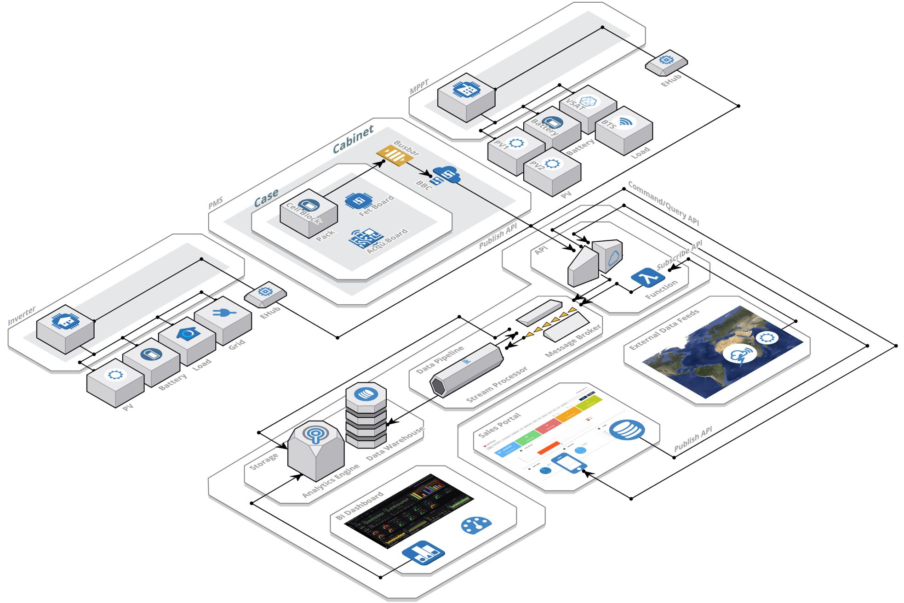
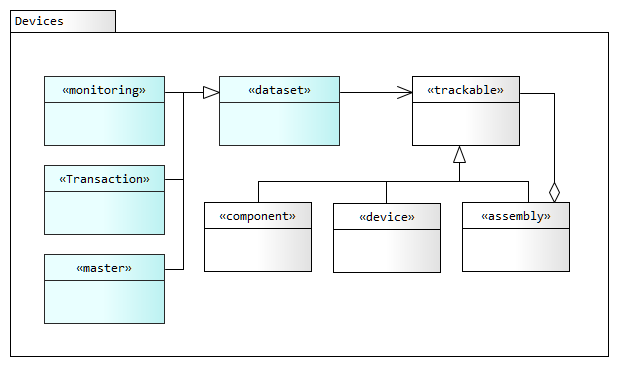

# Data Management Platform
---

The Sundaya Data Management platform consist of the following core components:

1. **Energy Management Devices** - such as PMS, MPPT, and Invertersm which produce monitoring data.  

2. **Device Controllers** - such as BBC or EHub Gateways which collect and upload the monitoring data.

3. **Trilateral API** - 

4. **Data Pipeline** - 

5. **Data Storage** - 

6. **Data Visualisation** - 

# Dataset Metamodel
---

Device data consists of three dataset types for trackable devices, shown in the model below. 

A _trackable_ item provides datasets which allow the item to be tracked in real-time or through retrospective reports. The data is used to trace problems and trends in the item's supply chain, operational performance, maintenance, etc.
 

### Dataset Types

- **monitoring data** - infinite and unordered time-series data collected through a recurring schedule. Typically this dataset consists of device metrics streamed by a device controller (BBC) or a device gateway (EHub), in near-real-time. However some data may be delayed or arrive out-of-order with data from other devices in the same location; often due to poor connectivity seen in remote locations, or lack of system availability due to maintenance etc. The data is appended to a persistent log and is never modified.

- **transaction data** - these datasets contain business transactions including data inserts and updates. The data is changed (created or modified) based on a business events such as procurement, installation, and servicing. The data is typically sent through the Sales Portal app when a transaction is completed, or periodically (e.g. twice a day) through a data file for batch update. As the data is replicated and therefore latent, it can not be used in time-critical processes which depend on data consistency, such as real-time analytics or time-window based data aggregation.

- **master data** - the core data needed to uniquely define the other datasets, includign data and metadata for customers, sites, partners, suppliers, personnel, products and services. This includes product metadata from vendors. Data in this dataset is changed very infrequently.

### Trackable Devices (devices, components, assemblies)

Trackable devices are composites made of the following types:

- **component** - a device component which needs to identified and tracked is considered to be a trackable item. This includes device controllers and MOSFET boards. 

- **device** - a device is an item which provides core functionality in the energy management domain. These include inverters, batteries and appliances. 

- **assembly** - an assembly can contain devices, components, and sub-assemblies. These items are typically assembled or logically configured before shipment. They include battery cases and cabinets. 

