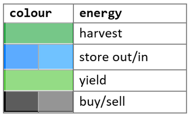

# Energy API

The `/energy` path provides data for four **Energy Types** :`harvest`, `store`, `yield`, `buy`. 

The API consolidates data for all four energy types in the requested period (week, month etc.).

API consumers use this data to manage and optimise their energy assets, through graphical views and by scheduling energy use at preferred times (through the `/devices` path).

The following table summarises the four **Energy Types** and examples of their data sources (devices). 

Energy      | Assets        | Devices
---         | ---           | ---
`harvest`   | Renewables    | PV Modules, Maximum Power Point Trackers (MPPT)
`store`     | Storage       | Busbar Controllers (BBC), Pack Management Systems (PMS)
`yield`     | Appliances    | Multicore-Cable Current Sensors, Switchboard Clamp Sensors
`buy`       | Grid          | Smart Meters, PV Grid-interactive Inverters

### Energy Flows

Energy flows are based on a "double entry" format where each flow has an equal and opposite flow, such that positive and negative flows in any given time period will produce a set of data elements which sum to zero. 

The following 6 data elements represent the conjunctive energy types in the API. 

The in and out flows are expressed with positive and negative values in the data. 

Energy                      | Description
---                         | --- 
`store.in` `store.out`   | *charge* and *discharge* flows to and from storage batteries. **battery.amps** ([mppt](../../Examples/POST/mppt%20POST%20example.md)) is positive for charge current (`store.in`) and negative when discharging (`store.out`).
`sell` `buy`             | *feed-in* and *feed-out* flows to and from the public or private grid. **grid.amps** ([inverter](../../Examples/POST/inverter%20POST%20example.md)) is positive for feeds into the grid (`sell`) and negative for feeds out of the  grid (`buy`).  
`harvest`                   | renewable energy generated by solar panels and other sources. **pv.amps** ([mppt](../../Examples/POST/mppt%20POST%20example.md)) is always positive.
`yield`                     | energy used by end users and appliances. **load.amps** ([mppt](../../Examples/POST/mppt%20POST%20example.md)) is always negative.

# /energy GET
---

The `/energy` path returns a ‘cube’ of energy data for a specified number of periods starting at an epoch.

The response contains aggregated data for the requested period, and for its child period. For example a request for a *week* period will produce a response with data aggregated for the *week* and for its child period: *day*.

The response will also include links to navigate from the reqested period to adjacent periods (next week, month etc.). 

- /energy/{`energy`}/period/{`period`}/{`epoch`}/{`duration`}?site={`site`}

    e.g. [https://api.sundaya.monitored.equipment/energy/hsy/period/week/20150204/1?site=999](https://api.dev.sundaya.monitored.equipment/energy/hsy/period/week/20150204/1?site=999 "energy=hsy, period=week, duration=1, site=999")

### Parameters

The following parameters are supported in energy requests. If a parameter is omitted it will be defaulted as shown. If the parameter is provided it will be validated against a controlled value list (enumeration) as specified in the API specification.     

Parameter                   | In            | Description               | Default
---                         | ---           | ---                       | --- 
`energy`                    | _path_        | The type of energy flow.  | *hsy*
`period`                    | _path_        | The time window for which total energy is aggregated. The only exception is 'instant' (which is for a single point in time, a millisecond) which is presented without aggregation. | *week*
`epoch`                     | _path_        | The starting date and time for the period. | *now*
`duration`                  | _path_        | The number of periods to return starting at epoch. | *1*
`site`                      | _query_       | The customer site where energy assets have been installed. | *999*
`productCatalogItems`       | _body_        | The installed products for which the data should be filtered. | *any*

### Path parameters
- __energy__ - Specifies one of the four energy data types (described above), or `hsy` if all four data types are required. `hsy` stands for `harvest`, `store`, `yield` but implicitly also includes `buy` (for transactions from/to the public grid).

- __period__ - The `period` parameter specifies the unit of aggregation for data returned by the request. 

    Each period is associated with a child and grandchild period as shown in the table below. For example a request for a */week* period will return total energy for each *day* (child period) and a breakdown of daily energy for each *hour* (grandchild period).

- __epoch__ - The `epoch` parameter specifies the starting date-time of the period. 

    If the epoch is a partial date or time (such as '2019' or '201910') it will be 'blended' with the *current* date and time to create a complete UTC epoch. For example a request for '_this week last year_' can be expressed with an epoch simply specified as '_2018_': the API will construct and return data for 2018 in the current month and week. 
    
    Note that the returned data will also display the epoch for each `period` in the `href` attribute of links.

- __duration__ - The `duration` parameter can be a positive or negative integer, which specifies the number of periods required. 

    A request for a */week* period with a _positive_ duration of __3__ will return 3 periods of weekly energy data _starting_ at the requested epoch. 
    
    If the duration is _negative_ the duration will be retrospective to the requested epoch. For example a request for a */week* period and duration of __-3__ will return data for the previous three weeks, _ending_ at the requested epoch.

The table below describes each `period` and supported timestamp formats for `epoch`. 

- The *compressed* format is used in hyperlinks (in the `href` attribute) and the *uncompressed* format is intended for use in display labels.

- An `instant` represents a single point in time (a millisecond). As such there is no data aggregation for `instant`.

- `second` and `minute` periods both include aggregates of any instants in which data was logged.

- `timeofday` refers to 6-hourly blocks of time for Morning, Afternoon, Evening, Night.

Period | Child Period | Duration | Grandchild Period | Duration | Format (*compressed*) | (*uncompressed*)
--- | --- |--- | --- | --- | --- | --- 
`instant` | - | - | - | - | YYYYMMDDTHHmmss.SSS | DD/MM/YY HHmmss.SSSS
`second` | `instant` | *varies* | - | - | YYYYMMDDTHHmmss | DD/MM/YY HHmm:ss
`minute` | `second` | 60 | `instant` | *varies* | YYYYMMDDTHHmm | DD/MM/YY HH:mm
`hour` | `minute` | 60 | `second` | 60 _(3600)_ | YYYYMMDDTHHmm | DD/MM/YY HH:mm
`timeofday` | `hour` | 6 | `minute` | 60 _(360)_ | YYYYMMDDTHHmm | DD/MM/YY HH:mm
`day` | `hour` | 24 | `minute` | 60 _(1440)_ | YYYYMMDD | DD/MM/YY
`week` | `day` | 7 | `timeofday` | 4 _(28)_ | YYYYMMDD | DD/MM/YY
`month` | `day` | *varies* | `hour` | *varies* | YYYYMMDD | DD/MM/YY
`quarter` | `month` | 3 | `day` | *varies* | YYYYMMDD | DD/MM/YY
`year` | `quarter` | 4 | `month` | 3 _(12)_ | YYYYMMDD | DD/MM/YY
`fiveyear` | `year` | 5 | `quarter` | 4 _(20)_ | YYYYMMDD | DD/MM/YY

### Query parameters
In all requests the caller must also provide the following query parameters:

Parameter | Description | Default
--- | --- | --- 
`site` | Identifier of the customer site where energy assets have been installed. | *999*

### Body parameters
The `productCatalogItems` optional body parameter specifies a query filter for `/energy` data to be restricted to one or more products. 

The query response will contain data for *any* of the product categories, subcategories, and product types specified in the parameter. 

- If the `productCatalogItems` parameter is missing data will be returned for all products.

- If multiple products are specified data will be returned for *any* of those products.

- If a `productCategory` is specified without a subcategory or product type data will be returned for *all* subcategories and types in that category.

- The same applies if a category and `productSubcategory` is specified without a `productType`.

# /energy GET Response
---

### Link attributes

Response data is returned in a JSON Collection and includes links for the user to navigate to adjacent datasets, for example to the next or previous *week*, or to the previous *month*.

Links have the following attributes:

- **rel**  - The rel property contains the link-to-collection relationship descriptor, which can be one of the following: `self`, `collection`, `up`, `down`, `next`, `prev`, `service-meta`. These are described below in **Link-relation types** 

- **prompt** - A brief description of the link.

- **title** - The title to display alongside the data for this item, and can be used as a caption or tooltip in the presentation..

- **href** - The URI or URL of the resource.

- **description** - The descriptor for use in applications). If **rel** is `service-meta` this field contains JSON metadata for the resource.   

    For "self" links the `description` consists of a list of the resource parameters:
    
    `energy`, `period`, `epoch`, `duration`, `site` 

    e.g:

    -   "rel": "self", "name": "week", "description": "`hsy week 20190204 1 999`"

    -   "rel": "collection", "name": "week.day" "description": "`Mon Tue Wed Thu Fri Sat Sun`"

    -   "rel": "collection", "name": "day.timeofday" "description": "`Morning Afternoon Evening Night`"

- **render** - 'image' or 'text' if the link should be retrieved and embedded; or 'link' to display as-is. If the property is missing the href link does not need to be presented.

The following table shows a set of links provided with energy data for a *week* period. 

### Link-relation types

The `rel` attribute of links in `application/vnd.collection+json` responses will contain one of the following registered link-relation types. 

The types are based on [RFC8288](https://tools.ietf.org/html/rfc8288#page-6).

- **self**	- Identifies the link's context.

    In `collection.links` it points to the collection as a whole (`name`=*'week'*)            

    e.g. href=[https://api.sundaya.monitored.equipment/energy/hsy/period/week/20190210](https://api.dev.sundaya.monitored.equipment/energy/hsy/period/week/20190210)

    In `collection.items.links` it points to a child item in the collection (`name`=*'day'*).

    e.g. href=[https://api.sundaya.monitored.equipment/energy/hsy/period/day/20190204](https://api.dev.sundaya.monitored.equipment/energy/hsy/period/day/20190204)

- **collection** - in `collection.links` it points to the child items which make up the collection (`name`=*'week.day'*).
    
    e.g. href=[https://api.sundaya.monitored.equipment/energy/hsy/period/day/20190204](https://api.dev.sundaya.monitored.equipment/energy/hsy/period/day/20190204)

- **item** - in `collection.items.links` it points to the subitems of the child item: i.e the grandchild items of the collection (`name`=*'day.hour'*).

    e.g. href=[https://api.sundaya.monitored.equipment/energy/hsy/period/hour/20190205T0600](https://api.dev.sundaya.monitored.equipment/energy/hsy/period/hour/20190205T0600)

- **up**, **down** - Identifies the parent (`up`) or child (`down`) of the period respresented by a collection or item. 

    The link's `name` attribute denotes parent or child period: 
    For example a *'week'* collection might have a link with 'rel=`up`' and 'name=*month*`, to refer to the parent period of the week.
    
- **next**, **prev** - Identifies the next or previous sibling of the item series (`name` = *'week'*). 

    The `prompt` and `title` properties signify the next or previous item in the series (`prompt` = *'Week 07 2019'*).

- **service-meta** - adds a service description metadata link (see [RFC8631](https://tools.ietf.org/html/rfc8631#page-8)). 

    The `name` attribute denotes the *object type*, for example **period**.
    The `description` attribute is a JSON object containing metadata for the object. 
    
    For example a link with 'rel=`service-meta`' and 'name=*period*` provides metadata about the period of the energy data it represents.

### Accept 'text/html' page format

If the client specifies *text/html* in the request `Accept` header a formatted graph is returned as shown below.

The page displays labels and hyperlink elements from the hypermedia dataset as shown.

---

# Visualisations
---
The API helps depict energy flows in graphical views, as time-windowed energy flow from 'sources' at the top, to 'sinks' at the bottom. 

Sources | Sinks    
--- |---
`harvest`, `store.out`, `buy` |`yield`, `store.in`, `sell`

For any given time window the net flows from source and sink data elements will sum to zero. 

This is best depicted in a stacked bar graph as shown in the `period` graph above.

**Colours**

The standard colours for each data element type is shown below.

**Top tier**

- _Green_ represents renewable energy generation (`harvest`) and is always shown in the top tier.
- _Black_ in the top tier shows energy drawn from the grid (`buy`).
- _Blue_ in the top tier shows energy *discharge* from batteries (`store.out`).

**Bottom tier**

- _Red_ represents energy consumption (`yield`) and is always shown in the bottom tier.
- _Black_ in the bottom tier shows a net excess (of `harvest` energy, compared to `store.in` and `yield` energy volumes), resulting in feed-in flows to the grid (`sell`).
- _Blue_ in the bottom tier shows battery *charge* (`store.in`) again due to a net excess of `harvest` energy.

### Example

A graph with lot of _Black_ in the top tier indicates an opportunity to reduce long term costs.  

In general it indicates a need for more battery capacity and/or `harvest` generation capacity. 

The example shows the following behaviour:
- In the 1st hour all `yield` energy came from the battery (`store.out`). 
- In the 2nd hour half came from battery and the other half from grid (`buy`). 
- In the 3rd hour all came from the grid.
- In the 4th hour the sun starts delivering (`harvest`)
- In the 10th hour harvest data is more than yield and the energy flows into store (`store.in`)
 
Note: To query specific assets, API consumers can also filter requests by `category`, `subcategory`, and `productType` (in the request *Body*).

