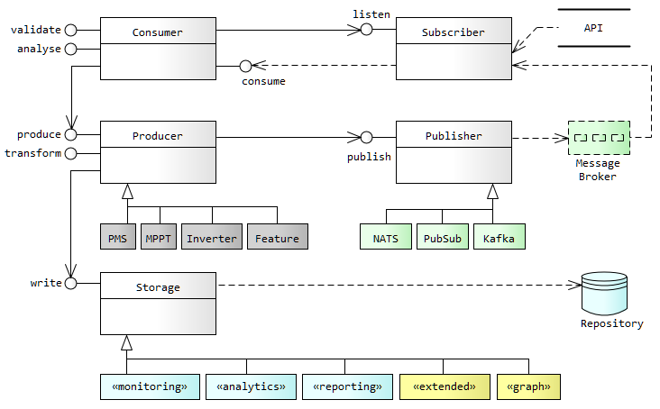

# Messaging
---

The messsaging platform leverages a framework which is implemented by all platform services. 

The framework encapsulates multiple broker technologies both in the cloud and the edge, and provides a standardised set of interfaces for flowing messages to brokers and repositories.

- A particular message broker can be made exclusively active through a service configuration change (and corresponding deployment of the broker). 

- The choice of broker and repository will usually depend on hosting costs and messaging volumes. 

  The requirements and choice of broker is expected to keep changing in each environment as the platform evolves and the number of connected devices increases.

---

#### Message flow

Messages are processed by the following sequence of interactions.

1. **Consumer** - instantiates a _Subscriber_ and calls the _listen_ method passing in the _Consumer_'s callback reference.

2. **Subscriber** - receives messages through the Broker or API and invokes the callback _Consumer_'s _consume_ method. 

3. **Consumer** - will _validate_ and _analyse_ the incoming message, then invoke the _produce_ method on the _Producer_.

4. **Producer** - will _transform_ message into an application-specified format then call _write_ on the _Storage_ class. 
   Optionally it will also call _publish_ to republish the transformed message to a new topic.

5. **Storage** - normalises the message into repository syntax and calls its client library to store the data in the Repository. 

6. **Publisher** - if the _Producer_  had optionally re-published the mesage (in step 4) the _Publisher_ will call broker's client library to deliver the transformed message to a new topic in the Message Broker.

---

# Topics

_Topics_ and _Subscriptions_ are listed in the table below. 

Producer service           | Topic                          | Subscription                
---                        | ---                            | ---                         
[api.tel_pms](/docs/api.sundaya.monitored.equipment/0/routes/devices/dataset/pms/post) [api.tel_mppt](/docs/api.sundaya.monitored.equipment/0/routes/devices/dataset/mppt/post) [api.tel_inv](/docs/api.sundaya.monitored.equipment/0/routes/devices/dataset/inverter/post) | `pub.tel_pms` `pub.tel_mppt` `pub.tel_inv` |  [sub.tel_pms.any_bq](/docs/api.sundaya.monitored.equipment/0/c/Implementation/Datasets/analytics/tel_pms) [sub.tel_mppt.any_bq](/docs/api.sundaya.monitored.equipment/0/c/Implementation/Datasets/analytics/tel_mppt) [sub.tel_inv.any_bq](/docs/api.sundaya.monitored.equipment/0/c/Implementation/Datasets/analytics/tel_inv) 
[api.sys_env_config](/docs/api.sundaya.monitored.equipment/0/routes/api/features/get) | `pub.sys_env_config` | [sub.sys_env_config](/docs/api.sundaya.monitored.equipment/0/c/Implementation/Datasets/extended/sys_env_config) 

- The `api.sys_env_config` producer propogates 'feature toggles' and logging configuration changes to each configurable service.

---

#### Kafka

Kafka is implemented in a multi-node cluster. The standard cluster is configured for high availability with  3 masters and N workers: 

- Worker nodes run __Kafka__ on port `9092`. 
- Master nodes run __Zookeeper__ on port `2181`, and do _not_ run brokers.

Topics are divided into `N` __partitions__ and have `f+1` __replicas__. 

The cluster is able to tolerate `f` failures with `f+1` replicas. 

Partition size will be reconfigured during operation based on the number of consumer groups; and message volumes and cardinality of keys used for producing messages.

The __default__ configuration has 3 partitions and 2 replicas per topic.

The following __topics__ are created at startup.

      `pub.tel_pms:3:2`, `pub.tel_mppt:3:2`, `pub.tel_inv:3:2`

- **kafka publishers** - With Kafka as the message broker the platform's publishers are Kafka producers. These are implemented with KafkaJS. 

   The producers require __acknowledgement__ from the leader only, acknowledgement from replicas is not required. 

   The default max number of __retries__ per call is 8.

   Each node in the producer cluster is given a unique __client id__, suffixed with a 4 digit random number:

      e.g. `producer.<nnnn>`

   The message key, which determines the partition, is the dataset id. 

      e.g. `pms.id`, `mppt.id` or `inverter.id`

- **kafka subscribers** With Kafka as the message broker the platform's Subscribers are actually Kafka consumers. These are implemented by KafkaJS. 

   The number of nodes in the consumer cluster must be less than or equal to the number of topic partitions.

   Each node in the consumer cluster is given a unique __client id__, suffixed with a 4 digit random number.

      e.g. `consumer.<nnnn>`

   Each node has multiple consumer listeners, one for each of the folowing monitoring __topics__.

      e.g. `pub.tel_pms`, `pub.tel_mppt`, `pub.tel_inv`

   The _subcription name_ is assigned as the Kafka consumer group id (as there are no subscriptions in Kafka).
   
      - Consumer listeners on all nodes share one of the following __group ids__, depending on which topic they listen to:

      e.g. `sub.tel_pms.any_bq`, `sub.tel_mppt.any_bq`, `sub.tel_inv.any_bq`

---
