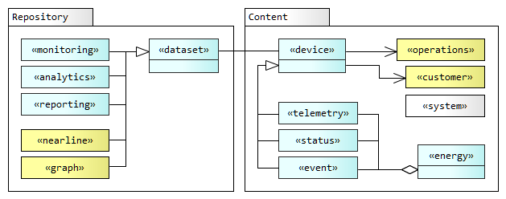

# Storage


Storage is provided by multiple cloud-native repositories based on the the principle of [polyglot persistance](https://martinfowler.com/bliki/PolyglotPersistence.html) and heterogenous data mananagement requirements for each dataset.

The storage solution for each dataset will be chosen based on trade-offs such as cost, mutability, scale, and velocity; as these vary significantly for each repository type. Similarly the content model (schema and data separability) will be shaped by the selected repository's technical constraints.

---

#### Data metamodel

The data metamodel below defines high-level relationships between _Repository_ archetypes and the _Content_ model.




---

# Repositories

Data is stored in six technically differentiated types of repository (depicted in the metamodel above).

- Data is ingested through two transient data puddles (_edge_, _monitoring_).

- The primary datasets are held in two warehouses (_analytics_, _reporting_).

- A secondary group of datasets are relatively static, master and extended data storage solutions (_extended_, _graph__). 

_Repository_ archetypes and their abbreviated mnemonics and qualifiers are listed below. 

The _Qualifiers_ are used in [Storage Service names](../../Getting%20Started/Start%20Here/Standards%20&%20Conventions.md).


Repository      | Mnemonic                  | Qualifiers                        | Qualified Name
---             | ---                       | ---                               | ---
monitoring      | `mon`                     | `mon_std`                         | _Stackdriver Monitoring_
analytics       | `any`                     | `any_bq`                          | _BigQuery Analytics_
reporting       | `rpt`                     | `rpt_bt`<br>`rpt_ds`              | _Bigtable Reporting_<br>_Datastore Reporting_   
edge            | `edg`                     | `edg_rds`<br>`edg_sql`            | _Redis Edge Data_<br>_SQLLite Edge Data_
extended        | `ex`                      | `ex_gcs`                          | _Google Cloud Storage Files_
graph           | `gr`                      | `gr_jg`<br>`gr_fs`<br>`gr_btsy`   | _JanusGraph Graph Data_<br>_Bitsy Edge Graph_<br>_Firestore Document Map_

_Repository_ archetypes are described in more detail below:

- **edge** - The _edge_ repository is a transient store for data collection and edge stream processing.<br><br>It also provides connection buffering by queuing and retrying messages undelivered due to connectivity loss or outage at the receiving end of the connection.<br><br>Suitable repositories would be in-memory (in-process) database such as _SQLLite_ or a lightweight key-value store such as _Redis_.

- **monitoring** - The _monitoring_ repository is a transient store for streaming device data. The data is used to monitor field devices in real time.<br><br>Data is streamed into an API endpoint by device controllers (BBC) or a device gateways (EHub) in near-real-time. Once received at the endpoint the raw data is logged and held in the monitoring subsystem, and available for viewing in the **OI dashboard**.<br><br>The data is produced by a rolling appender and purged after about 6 weeks.<br>

<br>

- **analytics** - Datasets in the _analytics_ repository track device performance over time, and enable problem tracing and trend analysis, including predictions.<br><br>Data is consumed from the streaming queue and stored in a relational format. The data may be joined with other datasets and accessed through SQL queries for anaytics (OLAP) in the **BI dashboard**.<br><br>Data rows are append-only and never modified.<br>

- **reporting** - The _reporting_ repository contains periodic aggregates of data aligned to time windows: for example energy data totals for a week.<br><br>The datasets are produced with low latency and high throughput from the streaming queue, by parallel processors. However some data may arrive late, often due to poor connectivity seen in remote locations, or when a data backlog is sent after the system is offline due to maintenance etc. The stream processors are able to align these late-arriving data with previously processed time windows.<br><br>The data is stored in a denormalised wide-column database for fast access by **API** and other application services and transactional systems (OLTP).<br>

<br>

- **extended** - The _extended_ repository is typically implemented by cloud storage or other file systems, It contains _master_ and _reference_ data for __parties_, _places_ and _things_; such as customers, suppliers, agents, sites, products, and services.<br><br>The data in this repository is not expected to change very frequently. Data is inserted and updated through Apps and the web tier when a transaction is completed, or periodically (e.g. twice a day) through a batch data file exported from stand-alone systems, such as the ERP system.<br><br>The reference data is stored as sheets or JSON documents.<br>

- **graph** - The _graph_ repository contains traversible relationships among _customer_ and _operations_ entities, such as the sales and service network. The underlying storage for the _graph_ repository is provided by the same wide-column database cluster used for _reporting_ data.<br><br>_graph_ data is retrieved using graph query language in the **Sales portal** implementation.

---

# Content 

_Content_ types and their abbreviated mnemonics are listed below. 

The mnemonics are used in [Dataset names](../../Getting%20Started/Start%20Here/Standards%20&%20Conventions) listed below based on naming conventions.

Content         | Mnemonic          | Dataset names                 | Dataset 
---             | ---               | ---                           | ---
telemetry       | `tel`             | [tel_pms](../../Implementation/Datasets/analytics/tel_pms.md)<br>[tel_mppt](../../Implementation/Datasets/analytics/tel_mppt.md)<br>[tel_inv](../../Implementation/Datasets/analytics/tel_inverter.md)  | _PMS Telemetry_<br>_MPPT Telemetry_<br>_Inverter Telemetry_ 
status          | `sts`             |                               | 
event           | `evt`             |                               | 
energy          | `eng`             | [eng_period](../../Implementation/Datasets/reporting/eng_period.md) | _Energy Periods_    
device          | `dev`             |                               | 
system          | `sys`             | [sys_data_src](../../Implementation/Datasets/extended/sys_data_src)<br>[sys_env_config](../../Implementation/Datasets/extended/sys_env_config)    | _Data Sources_<br>_Environment Configurations_ 
operations      | `ops`             | [ops_install](../../Implementation/Datasets/extended/ops_install)<br>[ops_pack_assembly](../../Implementation/Datasets/extended/ops_pack_assembly)<br>[ops_agent](../../Implementation/Datasets/graph/ops_agent)   | _Installations_<br>_Pack Assemblies_<br>_Agent Operations_
customer        | `cust`            | [cust_site](../../Implementation/Datasets/extended/cust_site)                   | _Customer Sites_<br> 

_Content_ types are described in more detail below:

- **telemetry** - consists of sensor data about the monitored devices and environment. The data is read-only/ append-only. The data is sent in one of the following methods<br><br>1. As a complete dataset sent at a frequent interval, including unchanged data.<br>2. As a partial dataset for _change-data-capture_, and data transmission only when a change is detected.<br><br>_telemetry_ data is processed using [write coalescing](../../Implementation/Architecture/Edge%20Cloud) to compresses and reduce write traffic from edge to cloud.<br>

- **status** - describes the state of the monitoring equipment, not the business-functional data and environment.<br><br>The data is read-only /append-only.<br>

- **event** - _event_ data is produced from _telemetry_ and _status_ data at the edge or in the cloud, based on rules and ML predictions.<br><br>Updateable configurations are sent to edge devices to select variables (features) and provide trained models, which are then impacted during data collection to generate events.<br>

- **energy** - consists of energy aggregates for _telemetry_ data.<br><br>The data is aligned with an epoch (starting millisecond) of a categorical period such as 'month', 'week', 'day' and 'timeofday'.<br><br>Canonical periods are described in the [energy API](../../Getting%20Started/API%20Overview/Energy%20API) overview page.<br>

- **system** - contains configuration data for the platform, including parameters needed for security, traceability, and data provenance. It includes script parameters and configuration data for provisioning and commissioning devices.

---

# Datasets 

The following table enumerates all datasets present in the solution according to the mnemonics in the above metamodel, and the primary application of the dataset. 

Dataset | Repository | Content | Application
--- | --- | --- | ---
[pms_telemetry](../../Implementation/Datasets/analytics/pms_telemetry)<br>[mppt_telemetry](../../Implementation/Datasets/analytics/mppt_telemetry)<br>[inverter_telemetry](../../Implementation/Datasets/analytics/inverter_telemetry) | `monitoring`, <br>`analytics` | `telemetry`, `status` | `OI dashboard`<br>`BI dashboard`
[period](../../Implementation/Datasets/reporting/period) | `reporting` | `energy`, `telemetry` | `Energy API`
[agent_operations](../../Implementation/Datasets/graph/agent_operations) | `graph` | `customer`, `operations` | `Agent portal`
[site_customer](../../Implementation/Datasets/extended/site_customer)<br>[installation_operations](../../Implementation/Datasets/extended/installation_operations)<br>[pms_pack_](../../Implementation/Datasets/extended/pms_pack)<br>[source](../../Implementation/Datasets/extended/source) | `reference` | `customer`, `system` |

---


### Analytics dataset partitioning

All `analytics` dataset tables are partitioned based on the `time_event` field, into daily segments, to reduce cost and improve performance. 

Queries require a mandatory predicate filter (a WHERE clause) for the `time_event` attribute to limit the number of partitions scanned, as shown in this example.

```sql
SELECT 	pms_id, pack.id, cell.vcl, cell.vch, cell.dvcl
FROM `sundaya.analytics.tel_pms`
WHERE time_event BETWEEN '2020-02-08' AND '2019-02-12'
AND pms_id IN ('PMS-01-002', 'PMS-01-002')
```

`monitoring` dataset tables are further clustered based on the contents of the primary key column (`pms_id`, `mppt_id`, `inverter_id`).

Queries should filter on the clustered key column as shown in the above SQL example as this improves performance and reduces cost.

---

